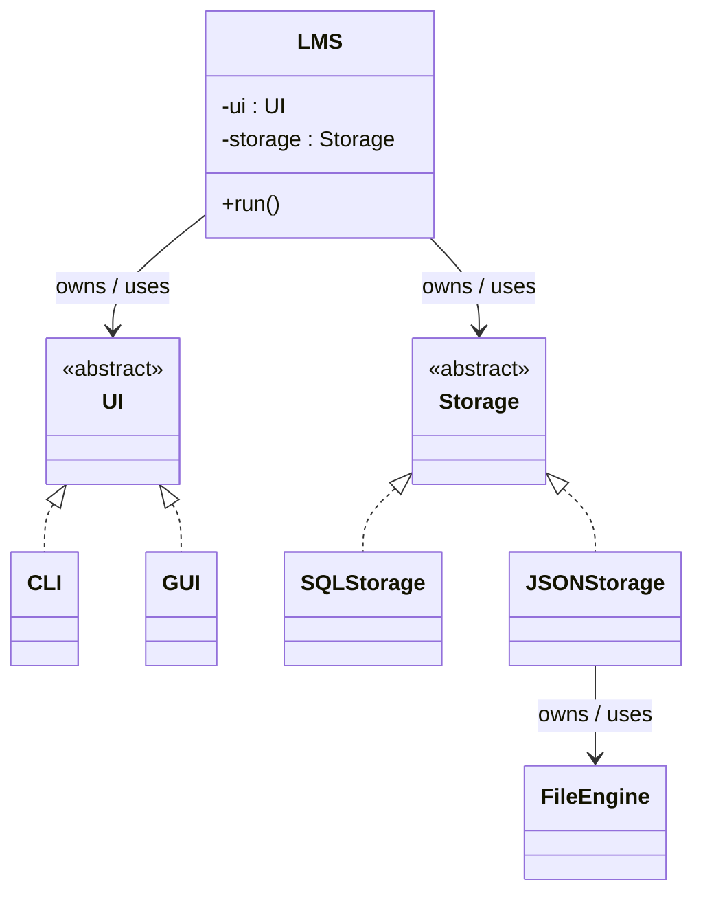

# Lego-LMS

* It is named Lego as you can just replace any of its components easily, the design facilates the DI principle.

* It is planned that it will support both CLI and GUI and it will be easily extensebile for adding other UIs

* It is planned that it will support both SQLStorage and JSONStorage and as you might guess it will be extensible for adding other storages.

This project is still under construction but its main design ideas are ready

